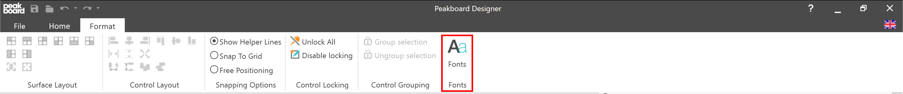
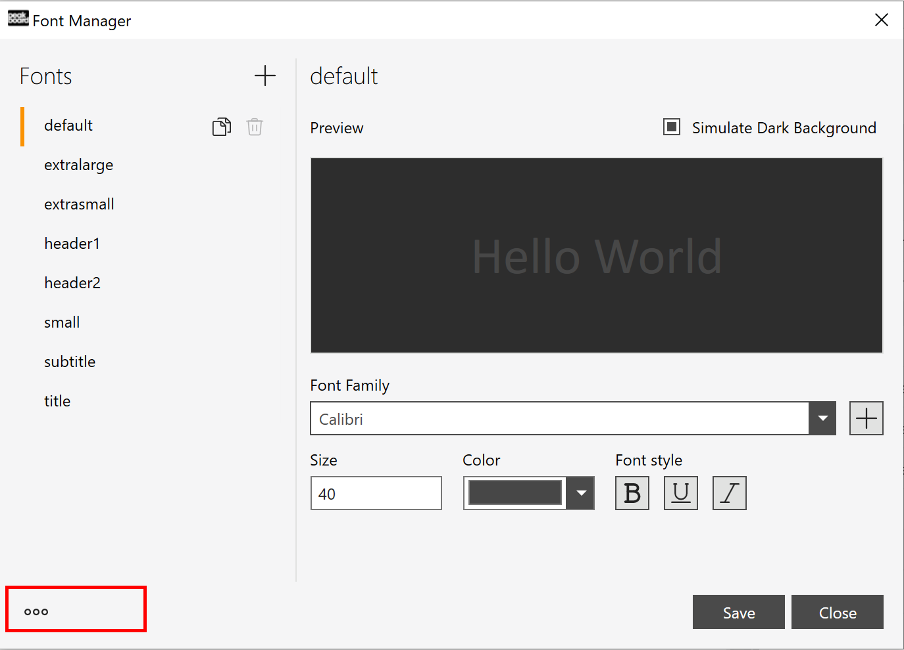
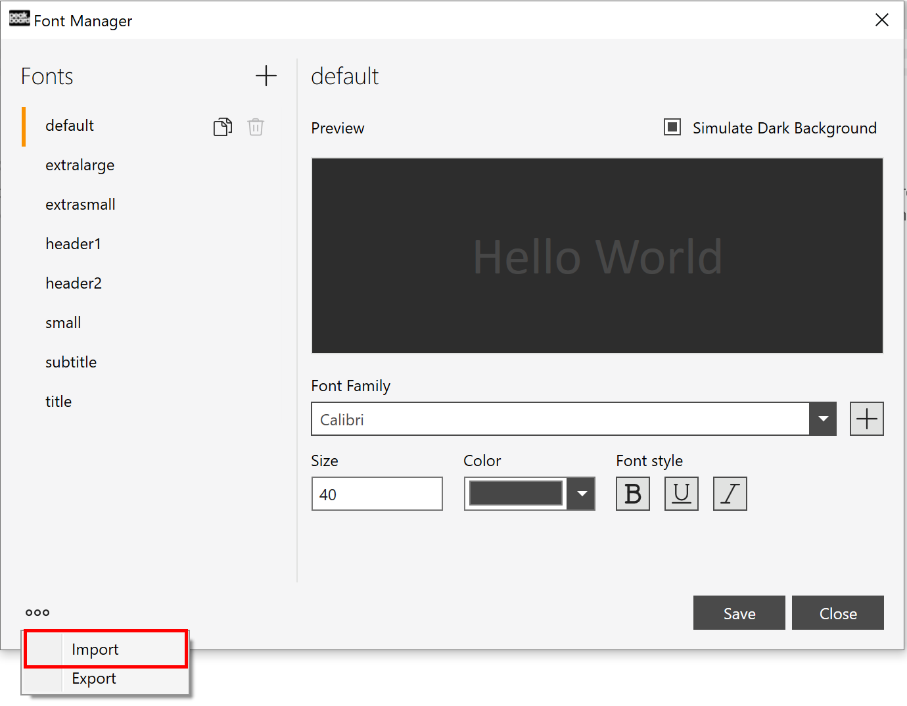

# how it works

To fully use this template, you need a font file which you can find [here](Fonts.pbsx). Open the Peakboard Designer and select "Fonts" from the ribbon menu.

Then click on the three dots icon at the bottom left.

Now click on "import", select the previously downloaded font file and you're ready to go.

