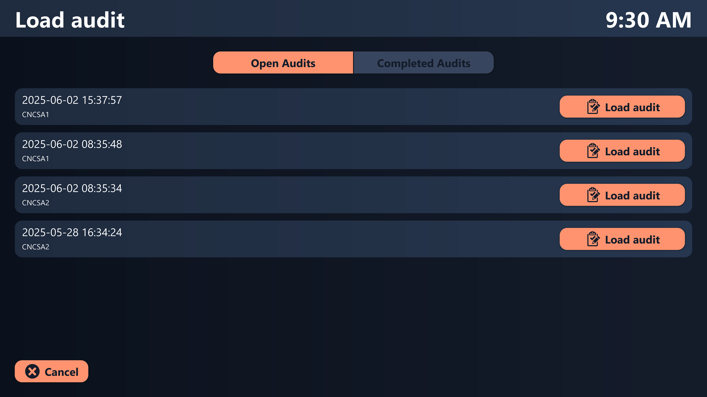

# Possible data sources
This template uses four different Peakboard Hub lists as data sources. The "Template Header" list contains the names and descriptions of all created audit templates. The associated "Template Item" list includes the individual audit steps for each template. The "Audit Header" list stores all audits created from one of the templates, while the "Audit Items" list contains all the captured values of the individual audit steps. To use this template with your own Peakboard Hub, you can download the table structure of the respective lists using the following links:  <a href="Template_Header.csv" class="inline" download>Template header</a> , <a href="Template_Item.csv" class="inline" download>Template item</a>, <a href="Audit_Header.csv" class="inline" download>Audit header</a> , <a href="Audit_Item.csv" class="inline" download>Audit item</a>.  Import these into Peakboard Hub and then adjust the data sources in the template accordingly. As an alternative to Peakboard Hub lists, this data could also come from one or more other databases.

# Overview of open and completed audits
The application provides an overview of all open and completed audits. This allows you to edit and complete audits that were started previously. Completed audits can also be reviewed.

