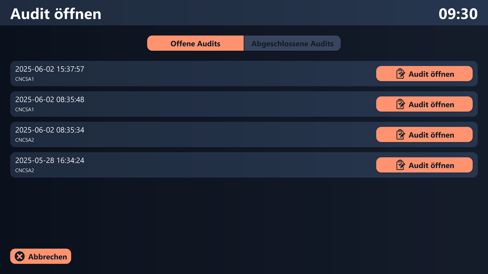

# Mögliche Datenquellen
Dieses Template nutzt vier verschiedene Peakboard Hub-Listen als Datenquelle. Die Liste „Template Header“ enthält die Namen und Beschreibungen aller erstellten Audit-Templates. Die zugehörige Liste „Template Item“ umfasst die einzelnen Auditschritte der jeweiligen Templates. Die Liste „Audit Header“ speichert alle Audits, die aus einem der Templates erstellt wurden, während die Liste „Audit Items“ alle erfassten Werte der einzelnen Auditschritte enthält. Um dieses Template mit deinem eigenen Peakboard Hub zu nutzen, kannst du über die folgenden Links die Tabellenstruktur der jeweiligen Listen herunterladen: <a href="Template_Assembly_Board_BillOfMaterials.csv" class="inline" download>Template header</a> , <a href="Template_Assembly_Board_BillOfMaterials.csv" class="inline" download>Template item</a>, <a href="Template_Assembly_Board_BillOfMaterials.csv" class="inline" download>Audit header</a> , <a href="Template_Assembly_Board_BillOfMaterials.csv" class="inline" download>Audit item</a>. Importiere diese in deinen Peakboard Hub und passe anschließend die Datenquellen im Template entsprechend an. Alternativ zu Peakboard Hub Listen könnten diese Daten auch aus einer oder mehreren anderen Datenbanken stammen. 

# Übersicht der offenen und abgeschlossenen Audits

Die Anwendung bietet eine Übersicht über alle offenen und abgeschlossenen Audits. Damit können zuvor begonnene Audits bearbeitet und abgeschlossen werden. Auch können abgeschlossene Audits eingesehen werden.

