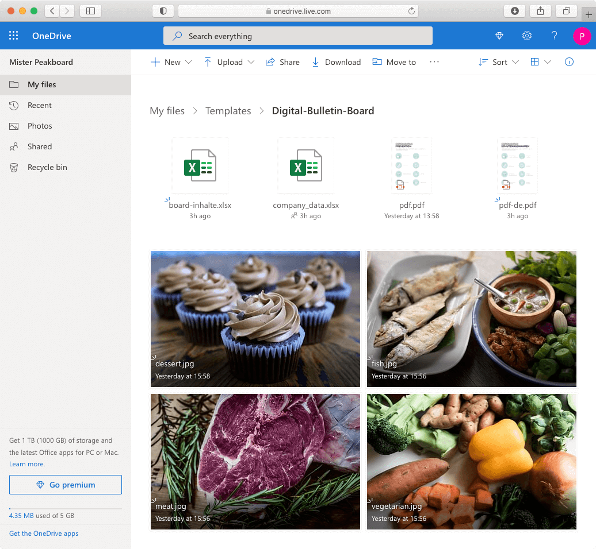
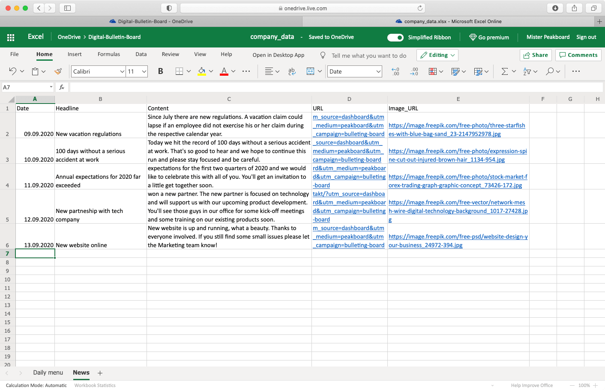
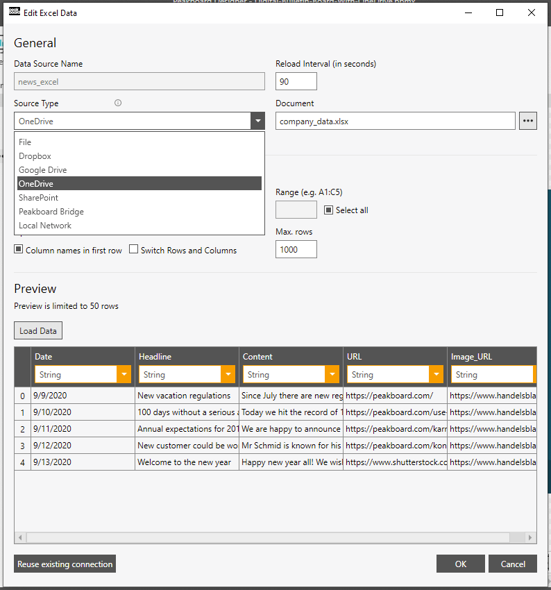

# 可使用的数据源

模板使用了OneDrive目录中的多张图片以及一个Excel文件。您也可以使用许多其他数据源，例如Google Spreadsheet，RSS Feed，JSON，XML，CSV，OData，Web Services，REST API，Microsoft Excel，Google Docs，MS SharePoint Lists，Dropbox，Microsoft OneDrive，Google Drive，Microsoft SharePoint Document Libraries，Microsoft Teams Files，本地文件服务器和[其他](https://peakboard.com/en/data-connections/)。

# 如何使用

[在此](https://peakboard.rocks/get-started)查看Peakboard简要介绍。如果您想了解如何将Peakboard Designer与Peakboard Box连接。以及相应地如何传输可视化，这篇[文章](https://peakboard.rocks/connect)可为您提供帮助。免费下载[Peakboard Designer](https://peakboard.com/en/peakboard-designer/?utm_campaign=templates&utm_medium=description_link&utm_source=templates_overview)。

从[Github](https://github.com/Peakboard/peakboard-templates.github.io/tree/master/_templates/Digital-Bulletin-Board-With-OneDrive/data-files)下载模板中的文件，以更新模板内容。将文件保存在合适位置。例如，您可以将文件保存在众多云服务中。如此一来，当您在对应地云服务中更新文件时，他们在模板中也会同时更新。您还可以将文件上传至Peaknoard“资源”，从而直接将其添加至可视化看板。

如果您想更换图片或显示的PDF文件，可以直接上传一个相同名称的文件替换。随后，看板就会展示新文件的内容。以下为OneDrive文件夹示例：

打开board-contents.xlsx文件之后您会看到两个数据簿，您可以在第一个工作簿中保存与午餐菜单相关的数据。您可以通过添加新日期、菜品名称和价格来更新行数据，菜品按照日期先后显示。您可以在第二个工作簿中更新消息，它会一直显示最后五行的数据。Excel文件截图：

将文件放在合适的文件夹并对其进行相应地个性化修改之后，您就可以将Peakboard与文件相连。在Peakboard Designer中打开该模板，并在“数据”栏中更新'news_excel'和'food_excel'两个数据源。选择使用的服务和文件，然后点击“加载数据”。

关闭对话框，更新完所有需要的数据源和资源并点击“预览”按钮之后，您就可以看到自己的数据。

## 天气插件更新
如果您不想使用天气插件，只需选中之后右键点击“删除”，即可将其从Peakboard Designer可视化看板中移除。

如果您需要使用天气插件，可以在该网址[https://weatherwidget.io/](https://weatherwidget.io/)创建自己所在城市的插件。

设定参数，例如城市、语言和单位。

找到满意的插件之后，点击“获取代码”。然后在弹出的窗口中，您就可以获得可立即使用的专属插件代码。点击“复制到剪切板”，即可复制代码。

返回Peakboard Designer，在侧边栏选择“网页插件”控件，或直接点击该天气插件。

在右侧边栏中，您可以看到该元素的某些参数。点击'HTML-Code'（2）栏的'...'按钮，然后在跳出的窗口中使用自己的代码替换已有代码（3）。

## 图片来源

本文中使用的图片和图样来自[Freepik](http://freepik.com/)和[Unsplash](https://unsplash.com/)。

- https://image.freepik.com/free-photo/three-starfishes-with-blue-bag-sand_23-2147952978.jpg
- https://image.freepik.com/free-photo/expression-spine-cut-out-injured-brown-hair_1134-954.jpg
- https://image.freepik.com/free-photo/stock-market-forex-trading-graph-graphic-concept_73426-172.jpg
- https://image.freepik.com/free-vector/network-mesh-wire-digital-technology-background_1017-27428.jpg
- https://image.freepik.com/free-psd/website-design-your-business_24972-394.jpg
- https://unsplash.com/photos/UCQCmt1i5ek
- https://unsplash.com/photos/bRdRUUtbxO0
- https://unsplash.com/photos/DVRXFIH42d0
- https://unsplash.com/photos/h5TDvTDwkBA
- Icons used in PDF [designed by Freepik](http://freepik.com/)