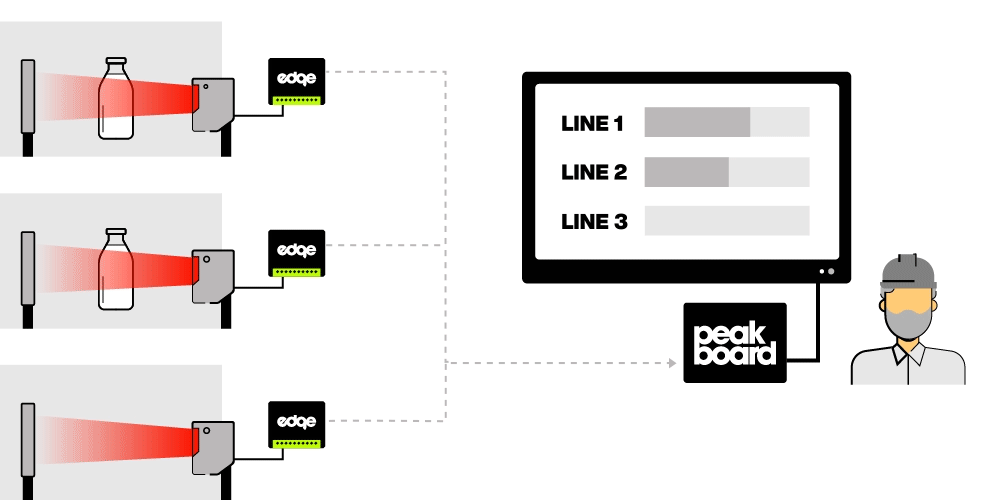

# Mögliche Datenquellen

Dieses Template verwendet die Peakboard Edge Datenquelle. Peakboard Edge kann Informationen über externe Geräte direkt ein- und ausgeben. Peakboard Edge kommuniziert dabei nicht über ein Display, sondern wird immer mit einer Peakboard Box verbunden. [Hier kannst du mehr über Peakboard Edge erfahren](https://peakboard.com/produkt/peakboard-edge/). 

# So funktioniert’s

Wie genau dieses Template funktioniert und wie du es selbst aufbauen kannst, erfährst du in diesem YouTube Video:


