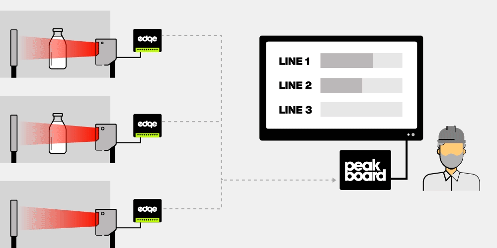

# 可使用的数据源

该模板使用Peakboard Edge数据源。它不依赖于显示屏，直接与Peakboard Box相连，可以直接输入并输出外部设备信息。[您可以在此了解Peakboard Edge的更多信息](https://peakboard.com/produkt/peakboard-edge/)。

作为Peakboard Edge的备选项，您也可以通过各种机器协议获取各灌装线的状态，例如MQTT、OPC UA、西门子S7、Werme、三菱电气或通过MES系统。部分支持的MES系统包括：FASTEC 4 PRO、FORCAM FORCE、DELMIA Apriso MES及[其他](https://peakboard.com/en/product/peakboard-versions/#dataconnections)。

# 如何使用

