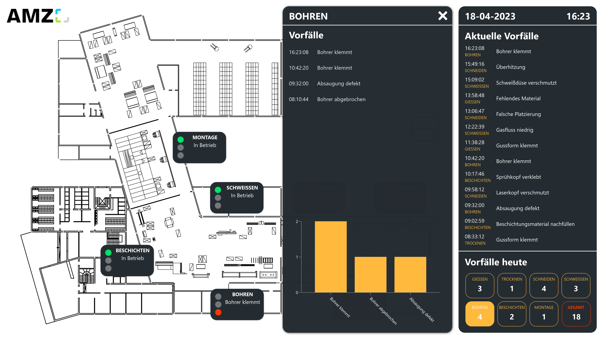

# mögliche datenquellen

Dieses Template verwendet OPC UA als Datenquelle. Du kannst stattdessen auch andere maschinennahe Kommunikationsmethoden wie: MQTT, Siemens S7, Azure Event & IoT Hub, Werma, Mitsubishi Electric, Beckhoff Automation, Bosch IoT Gateway, Rockwell Automation oder MT Connect anbinden. Die auftretenden Fehler werden in eine Peakboard Hub Liste gespeichert und von dort für das Dashboard ausgelesen. Alternativ können hierfür andere Datenbanken wie SQL, Oracle oder ODBC genutzt werden. Ebenfalls wird eine Peakboard Hub Liste mit den Fehlercodes und Fehlerbeschreibung jeder Maschine verwendet. Um dieses Template mit deinem eigenen Peakboard Hub zu nutzen, kannst du <a href="ErrorsList.txt" class="inline" download>hier</a> die Tabellenstruktur der Fehlerliste und <a href="ErrosMapping.txt" class="inline" download>hier</a> die der Fehlercodes herunterladen. Importiere diese in deinen Peakboard Hub und passe anschließend die Datenquellen im Template entsprechend an.

# detailanalyse im pop-up fenster

Mit einem Klick auf eine Kachel kannst du eine detaillierte Fehlerübersicht der entsprechenden Maschine öffnen: 

