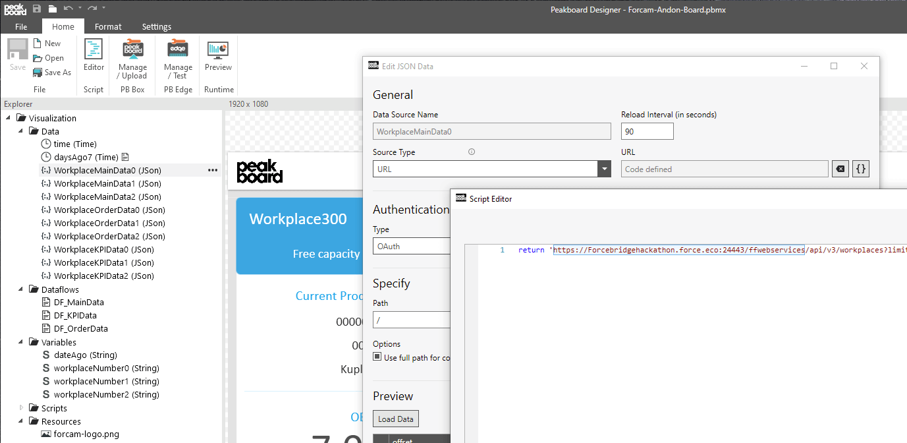
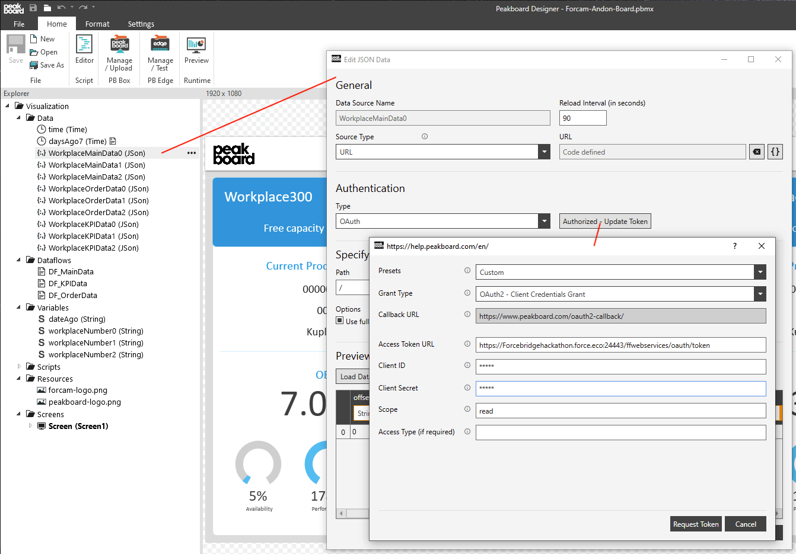
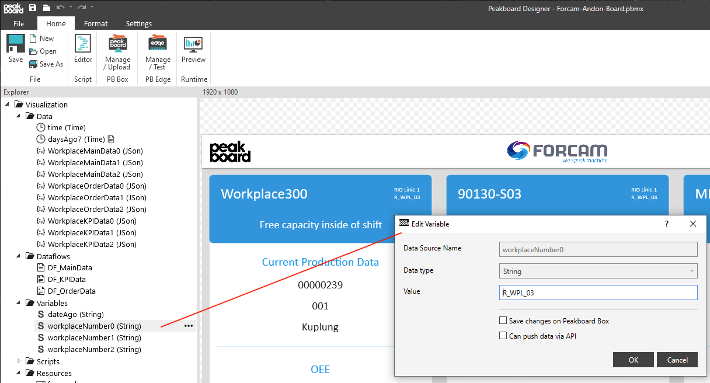

# so funktioniert's

Dieses Template verwendet die Forcam [ForceBridge API](https://docs.forcebridge.io/).

Passe bei den API Calls die jeweilige URL an dein System an (in Summe sind es 9 API Calls). 

Passe anschließend die Authentifizierung, deine Token URL und jeweils deine Client ID und deinen Client Secret an. Wenn du einen neuen Call an die API anlegen willst, kannst du bei der Authentifizierung immer das FORCAM Preset auswählen. 

Passe abschließend die Workplace Number Variablen an und gib deine 3 Workplaces an, die du auf deinem Dashboard visualisieren möchtest.

