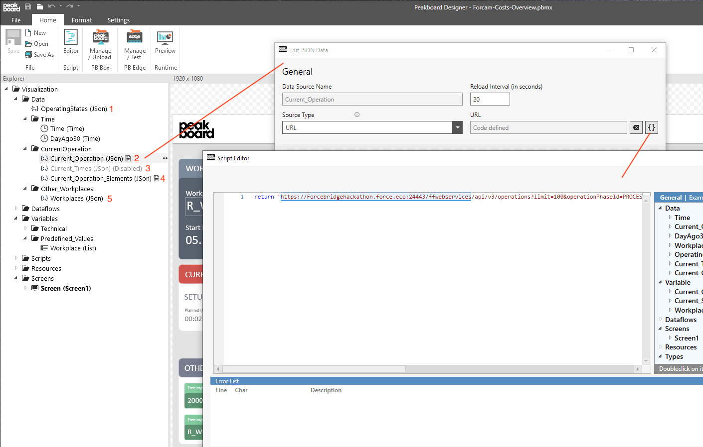
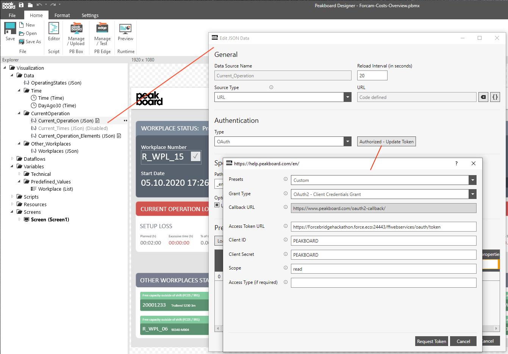
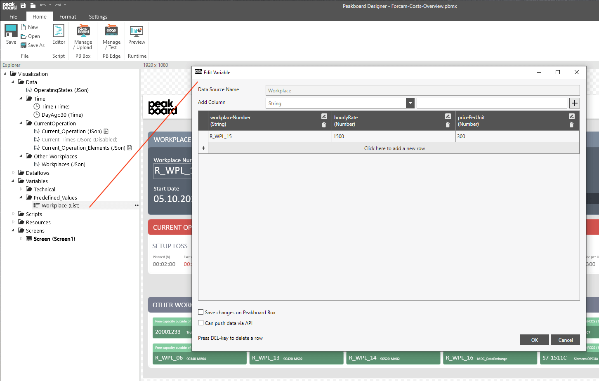
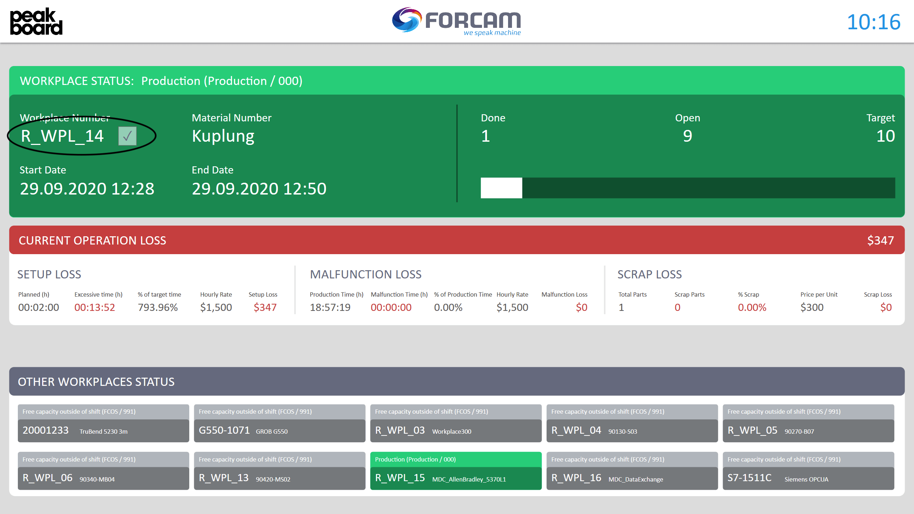

# how it works

In a first step, adapt the URLs of the JSON calls to the [FORCAM API](https://docs.forcebridge.io/) to connect the dashboard to your FORCAM system. Repeat this step for all 5 calls. The call 'Current_Times' (3) is disabled because it needs the operation ID from another call first. Only then the call can be executed.

Adjust the authentication afterwards. Enter your URL, your Client ID and your Client Secret. Use the FORCAM preset for further calls to the FORCE Bridge API.

Adjust the parameters in a next step. Specify which workplace you want to display and enter the hourly rate of your machine or workplace as well as the unit costs. You can of course also get these values from different systems. The example uses simple variables.

Change the workplace number at any time, even during operation, with the help of a touch screen or a mouse and keyboard to view other workplaces. Just click on the text field, enter the new workplace number and click on the button to confirm. If you don't need this function, simply remove the button and convert the input field into a normal text field.

