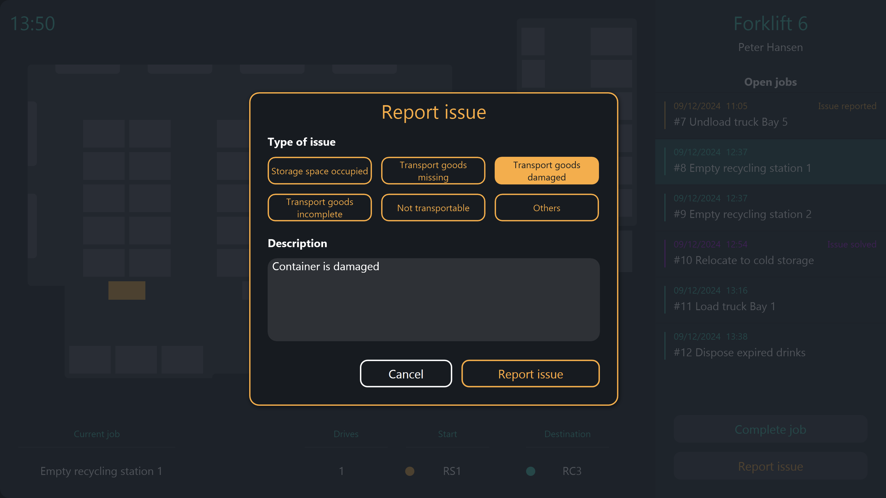

# Possible data sources
This template uses four different Peakboard Hub lists as the data source. The "Products" list contains master data for all products that your company manufactures. The "Materials" list contains master data for all materials that are kept in your warehouse and that are required to manufacture your products. The “Bill of materials” list contains data on the materials from which the individual products are made. The "Assembly steps" list contains data on the individual assembly steps of all products. To use this template with your own Peakboard Hub, you can download the table structure of the particular lists via the following links: <a href="Products.txt" class="inline" download>Products</a> , <a href="Materials.txt" class="inline" download>Materials</a> , <a href="BillOfMaterials.txt" class="inline" download>Bill of materials</a> , <a href="Assembly_Steps.txt" class="inline" download>Assembly steps</a>. Import these into Peakboard Hub and then adjust the data sources in the template accordingly. As an alternative to Peakboard Hub lists, this data could also come from one or more databases.

# Report issues
The application offers an easy way to report issues to the responsible persons.

