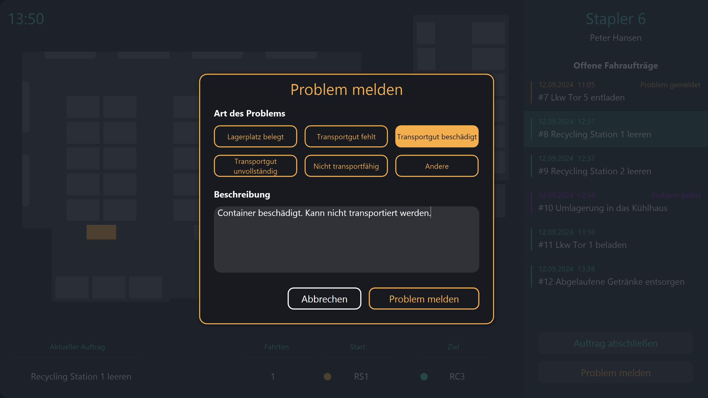

# Mögliche Datenquellen
Dieses Template verwendet verschiedene Peakboard Hub Listen als Datenquelle für die Stamm- und Bewegungsdaten. Alternativ zu Peakboard Hub Listen könnten diese Daten auch aus einer oder mehreren Datenbanken stammen. 

# Weitere Anzeigen
Die Anwendung bietet eine einfache Möglichkeit, Probleme an die Verantwortlichen Personen zu melden.

