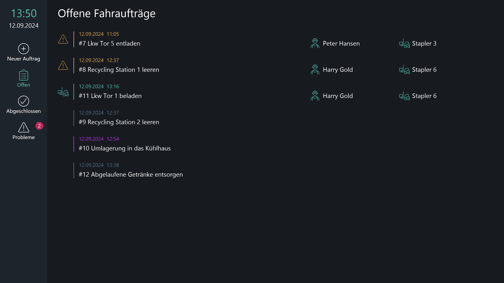
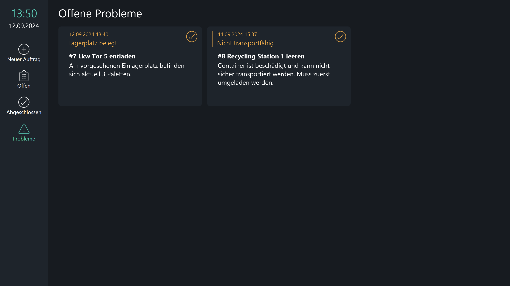

# Mögliche Datenquellen
Dieses Template verwendet verschiedene Peakboard Hub Listen als Datenquelle für die Stamm- und Bewegungsdaten. Alternativ zu Peakboard Hub Listen könnten diese Daten auch aus einer oder mehreren Datenbanken stammen. 

# Weitere Anzeigen
Die aktuell offenen Fahraufträge werden in einer übersichtlichen Liste dargestellt. Wurde ein Auftrag von einem Fahrer oder einer Fahrerin angenommen und bearbeitet, wird dies in der Liste angezeigt.

Detailansicht der aktuell gemeldeten Probleme, mit der Möglichkeit, diese als gelöst zu markieren.

