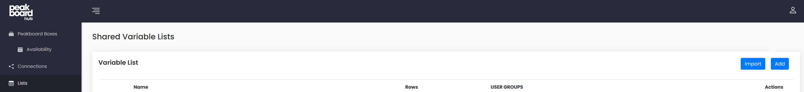
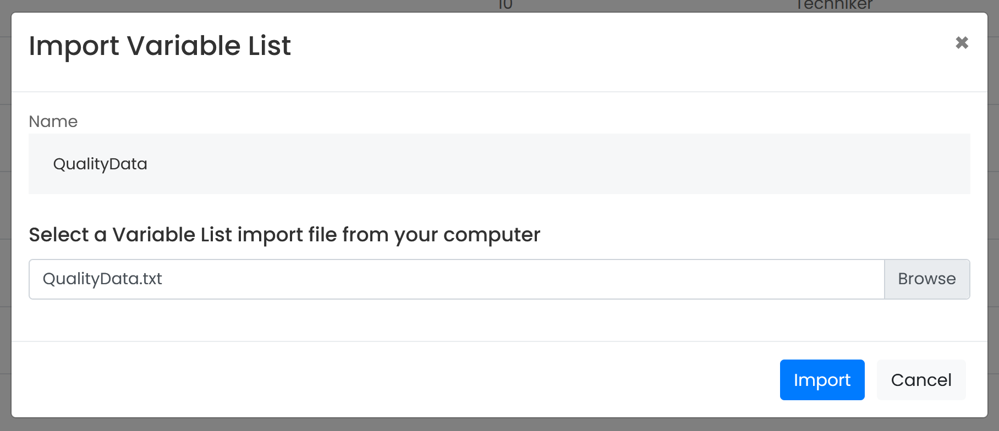
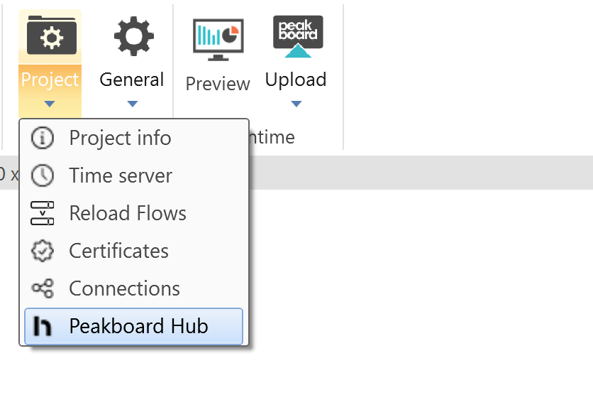
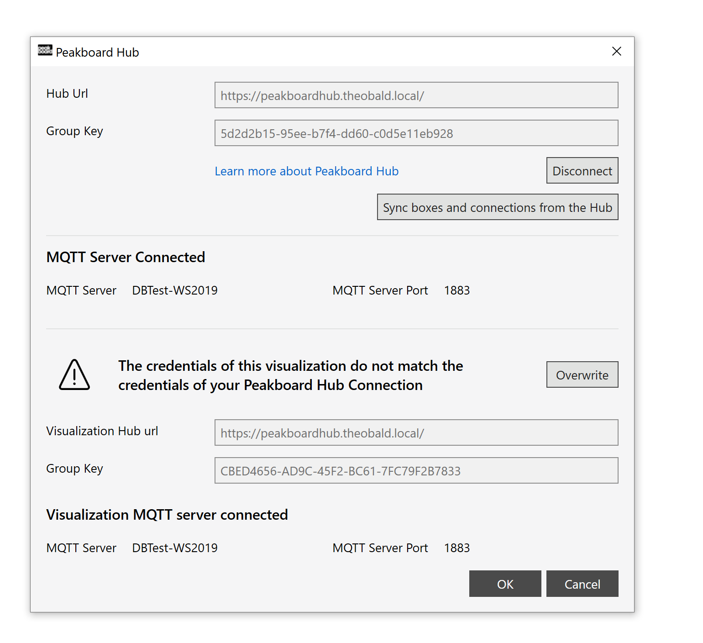

# possible data sources
This template uses a Peakboard Hub list as the central data source. The data collected using the touchscreen is written to a Peakboard Hub list, which is then read out for the data visualization. Alternatively, you can use other databases such as SQL, Oracle or ODBC for this purpose.

# how it works
Um dieses Template vollumfänglich nutzen zu könnten, benötigst du den Peakboard Hub. Wie du diesen installierst, erfährst du [hier](https://help.peakboard.com/hub/de-hub_installation.html). Öffnen den Peakboard Hub, wähle im Menü “Lists” und klicke auf den "Import" Button um die benötigte Tabellenstruktur zu importieren. Diese kannst du hier <a href="QualityData.txt" class="inline" download>hier</a> herunterladen. 

Das Feld "Name" solltest du mit “QualityData” ausfüllen und darunter die zuvor heruntergeladene Datei selektieren.

 Öffne nun den Peakboard Designer und stelle wie [hier](https://help.peakboard.com/hub/de-hub_connectpbdesigner.html) erklärt, eine Verbindung zum Peakboard Hub her. Öffne nun dieses Template im Peakboard Designer und gehe erneut in die Peakboard Hub Einstellungen unter Projekt/Project > Peakboard Hub.

 

Klicke auf den “Überschreiben/Overwrite” Button um die Hub Connection des Templates mit deinen eigenen Anmeldedaten zu überschreiben.

 

 Nun ist alles Bereit und das Template schreibt die erfassten Daten in die angelegte Liste im Peakboard Hub.
