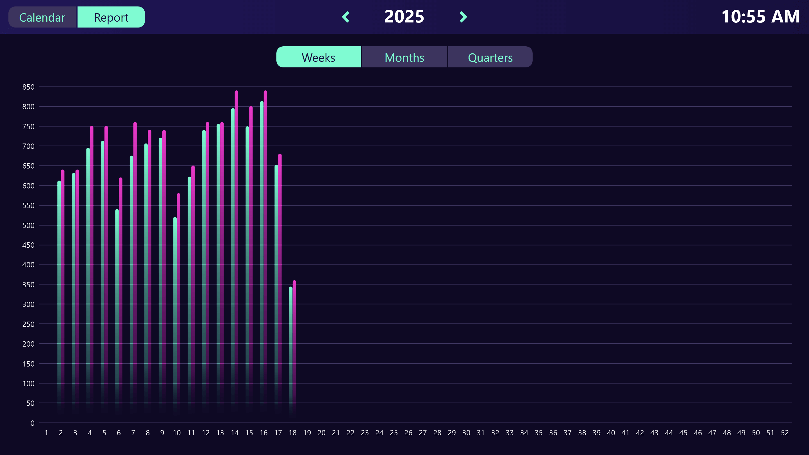

# Possible data sources
This template uses a Peakboard Hub list as the data source. To use this template with your own Peakboard Hub, you can download the table structure of the lists <a href="Calendar_View.csv" class="inline" download>here</a>. Import it into Peakboard Hub and then adjust the data sources in the template accordingly. Alternatively, the data could also come from various other databases.

# Report view
In addition to the calendar view, the template also offers a reporting view, which aggregates the data for analysis purposes and displays it by calendar week, month, or quarter.

