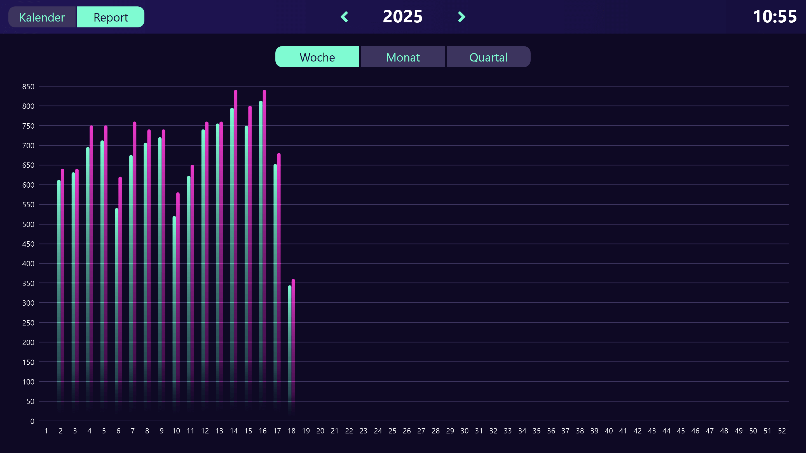

# Mögliche Datenquellen
Dieses Template verwendet eine Peakboard Hub Liste als Datenquelle. Um dieses Template mit deinem eigenen Peakboard Hub zu nutzen, kannst du <a href="Calendar_View.csv" class="inline" download>hier</a> die Tabellenstruktur der Liste herunterladen. Importiere diese in Peakboard Hub und passe anschließend die Datenquellen im Template entsprechend an. Alternativ zu Peakboard Hub Listen könnten diese Daten auch aus diversen anderen Datenbanken stammen. 

# Reporting Ansicht
Neben der Kalenderansicht bietet das Template auch eine Reporting Ansicht, welche die Daten zu Analysezwecken aggregiert pro Kalenderwoche, Monat oder Quartal anzeigt.

