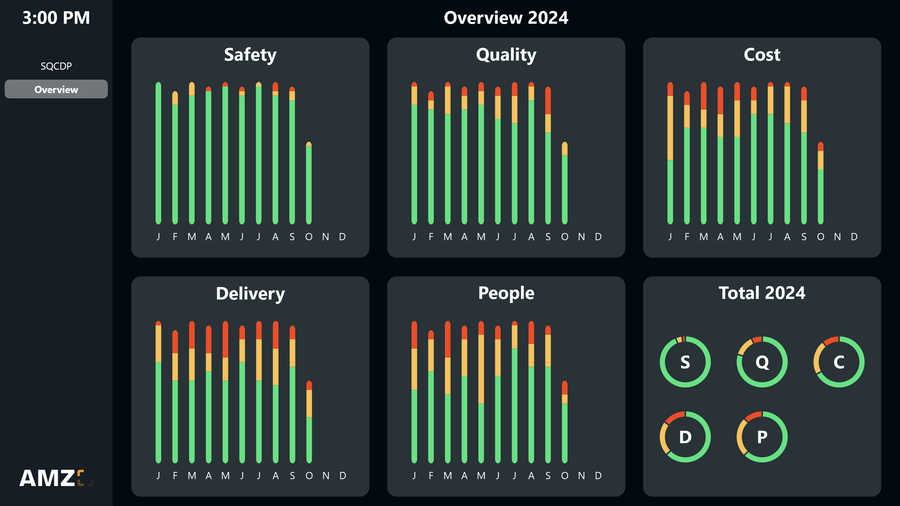

# Possible data sources
This template uses a <a href="https://peakboard.com/en/product/peakboard-hub/" class="inline" download>Peakboard Hub list</a> as its data source. To use this template with your own Peakboard Hub, you can download the table structure of the list <a href="SQCDP_Board.csv" class="inline" download>here</a>. Import this into your Peakboard Hub and then adjust the data sources in the template accordingly. Alternatively, you can also use other databases such as SQL, Oracle or ODBC.

# Further screens

Yearly overview of all categories

