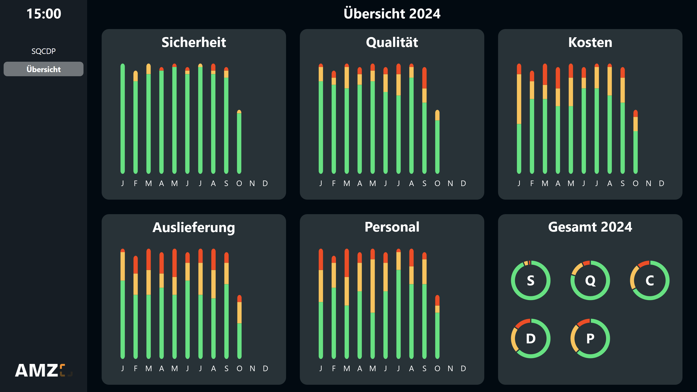

# Mögliche Datenquellen
Dieses Template verwendet eine <a href="https://peakboard.com/produkt/peakboard-hub/<" class="inline">Peakboard Hub Liste</a> als Datenquelle. Um dieses Template mit deinem eigenen Peakboard Hub zu nutzen, kannst du <a href="SQCDP_Board.csv" class="inline" download>hier</a> die Tabellenstruktur der Liste herunterladen. Importiere diese in deinen Peakboard Hub und passe anschließend die Datenquelle im Template entsprechend an. Alternativ können auch andere Datenbanken wie beispielsweise SQL, Oracle oder ODBC genutzt werden.

# Weitere Anzeigen

Übersichtliche Jahresübersicht über alle Kategorien
