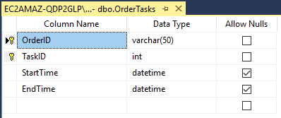

# 如何使用 

在该看板中，您可以根据自身需要修改TasksMetadata列表，轻松地对任务进行个性化设置。

如果您想在模板中使用数据库，只需在数据库中创建一个表格，其格式如何： 

然后在数据源"CurrentTasks"和"TodayTasks"中调整SQL服务器的数据连接，剩下的就交给Peakboard Box吧！

# 可使用的数据源

模板使用SQL数据库，它也展示了如何将数据写回数据库。但也可以使用其他数据系统，例如ODBC, MS SQL Server, MS Access, MS Azure SQL, Oracle数据库, IBM DB2, MySQL, PostgreSQL, MongoDB, Teradata或Wintool；ERP系统也适用于该模板。请在此[here](https://peakboard.com/en/interfaces/)了解完整的列表。
