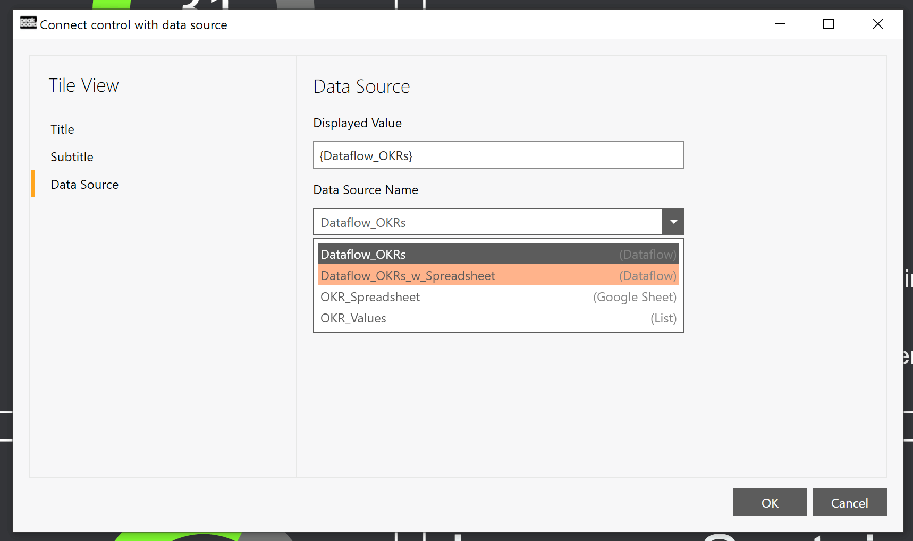

# possible data sources
This template uses Peakboard [variable lists](https://help.peakboard.com/scripting/de-variables.html) as data source. For your Use Case you can of course use your systems. Here databases or simple spreadsheets could be interesting, such as Microsoft Excel or Google Spreadsheet. But also standards like: JSON, XML, CSV, OData, Web Services, REST-API, ODBC, MS SQL Server, MS Access, MS Azure SQL, Oracle Database, IBM DB2, MySQL, PostgreSQL, MongoDB could be considered. Or you could also solve the whole thing via an ERP system. Peakboard offers many options: abas ERP, proALPHA ERP, Epicor ERP, Comarch ERP, QAD Adaptive ERP, SAP ERP or [many more](https://peakboard.com/schnittstellen/).

# use template with Google spreadsheet

If you want to use Google Spreadsheet as a datasource you just have to update the 'OKR_Spreadsheet' data source within the explorer and authorize your account. You'll need a Spreadsheet with the same structure as the variable list 'OKR_Values'. Finally you have to select the Tile View on the canvas and change the data source from the dataflow 'Dataflow_OKRs' to 'Dataflow_OKRs_w_Spreadsheet':

