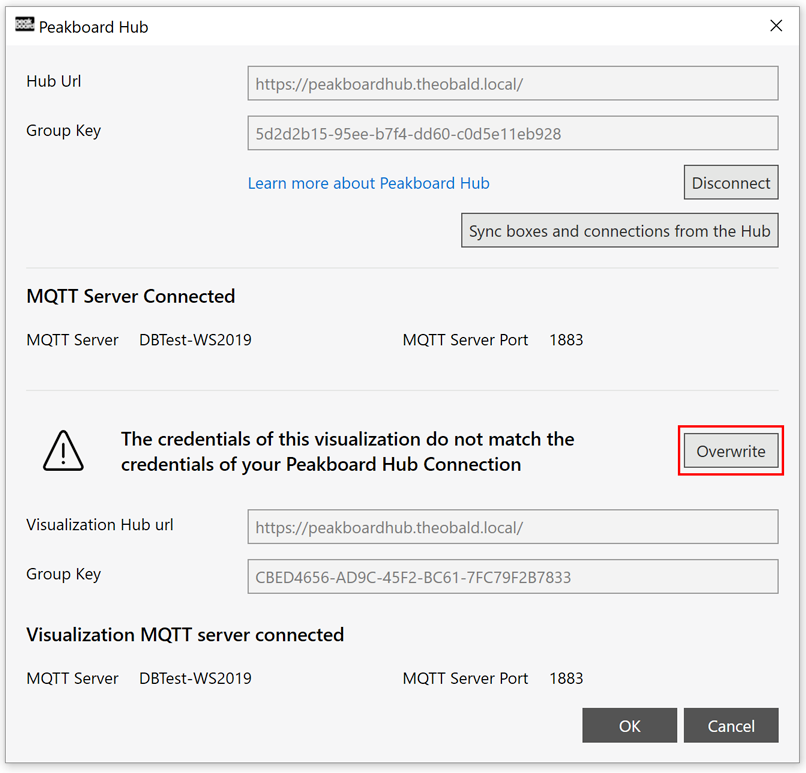

# mögliche datenquellen
Dieses Template verwendet eine Peakboard Hub Liste als zentrale Datenquelle. Die Daten in der Peakboard Hub Liste werden hierbei über [dieses](https://templates.peakboard.com/Interactive-Board-Manual-Quality-Control/index) interaktive Dashboard erfasst. Alternativ können hierfür auch andere Datenbanken wie SQL, Oracle oder ODBC genutzt werden.

# so funktioniert's
Um dieses Template vollumfänglich nutzen zu können, benötigst du Peakboard Hub. Wie du diesen installierst, erfährst du [hier](https://help.peakboard.com/hub/de-hub_installation.html). Öffne Peakboard Hub, wähle im Menü “Lists” und klicke auf "Import", um die benötigte Tabellenstruktur zu importieren. Diese kannst du <a href="QualityData.txt" class="inline" download>hier</a> herunterladen. 

Das Feld "Name" solltest du mit “QualityData” ausfüllen und darunter die zuvor heruntergeladene Datei wählen.

 Öffne nun den Peakboard Designer und [stelle eine Verbindung zu Peakboard Hub](https://help.peakboard.com/hub/de-hub_connectpbdesigner.html) her. Öffne nun dieses Template im Peakboard Designer und gehe erneut in die Peakboard Hub Einstellungen unter Projekt/Project > Peakboard Hub.

 

Klicke auf den “Überschreiben” Button, um die Peakboard Hub Connection des Templates mit deinen eigenen Anmeldedaten zu überschreiben.

 

 Nun ist alles bereit und das Template liest die Daten aus der angelegten Liste im Peakboard Hub.

