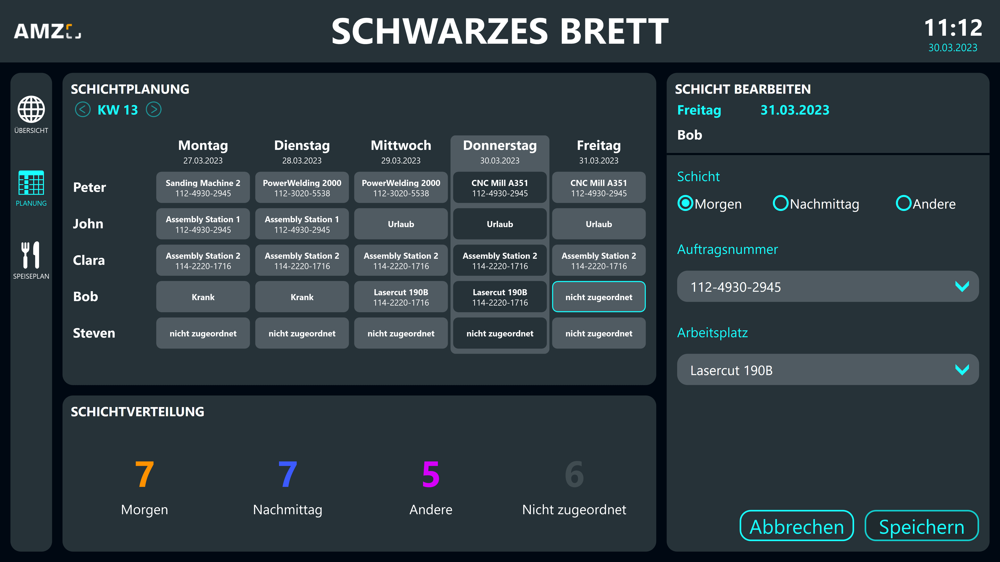
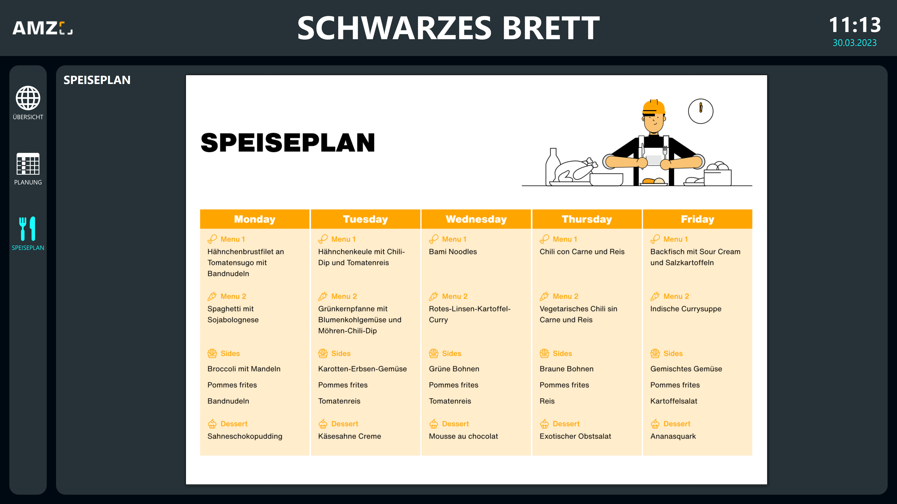

# Possible data sources
This template uses a Peakboard Hub list as the central data source. The data is entered with a mouse and keyboard connected to the Peakboard Box or a touchscreen and written to a Peakboard Hub list, which is then read for data visualization. As an alternative, you can use other databases for this, such as SQL, Oracle, or ODBC. The master data, such as the names of the team members and the workstations in the company, can also be maintained in a list in Peakboard Hub and read from there. To use this template with your own Peakboard Hub, you can download the table structure for a shift schedule <a href="Template_Shopfloor_Information_Board_Schedule.csv" class="inline" download>here</a>, an employee list  <a href="Template_Shopfloor_Information_Board_Staff.csv" class="inline" download>here</a>, and a workstation structure <a href="Template_Shopfloor_Information_Board_Workstations.csv" class="inline" download>here</a>. Import these into your Peakboard Hub and then adjust the data sources in the template accordingly.

# Further screens

Screen for shift planning:

Screen with weekly lunch plan:

# How it works
You can find detailed instructions for this template in this YouTube video.


