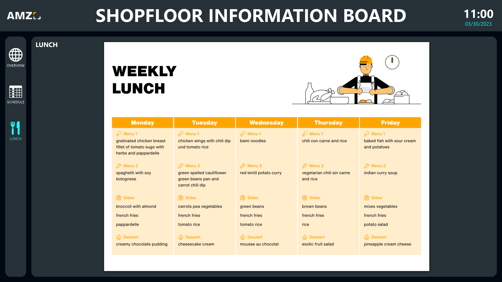

# Mögliche Datenquellen
Dieses Template verwendet eine Peakboard Hub Liste als zentrale Datenquelle. Die Daten, die mithilfe einer an die Peakboard Box angeschlossenen Maus und Tastatur oder eines Touchscreens erfasst werden, werden dabei in eine Peakboard Hub Liste geschrieben, die dann für die Datenvisualisierung ausgelesen wird. Alternativ können hierfür andere Datenbanken wie SQL, Oracle oder ODBC genutzt werden. Auch die Stammdaten, wie die Namen der Teammitglieder und die Arbeitsstationen im Unternehmen werden in einer Liste in Peakboard Hub gepflegt und von dort ausgelesen. Um dieses Template mit deinem eigenen Peakboard Hub zu nutzen, kannst du <a href="Schedule.txt" class="inline" download>hier</a> die Tabellenstruktur des Schichtplans, <a href="Staff.txt" class="inline" download>hier</a> die der Mitarbeitendenliste und <a href="Workstations.txt" class="inline" download>hier</a> die Struktur der Arbeitsstationen herunterladen. Importiere diese in deinen Peakboard Hub und passe anschließend die Datenquellen im Template entsprechend an.

# Weitere Anzeigen

Ansicht zur Erstellung und Bearbeitung des Schichtplans: 

Anzeige des wöchentlichen Speiseplans:

# So funktioniert’s
Eine detaillierte Anleitung zu diesem Template findest du in diesem YouTube Video:



