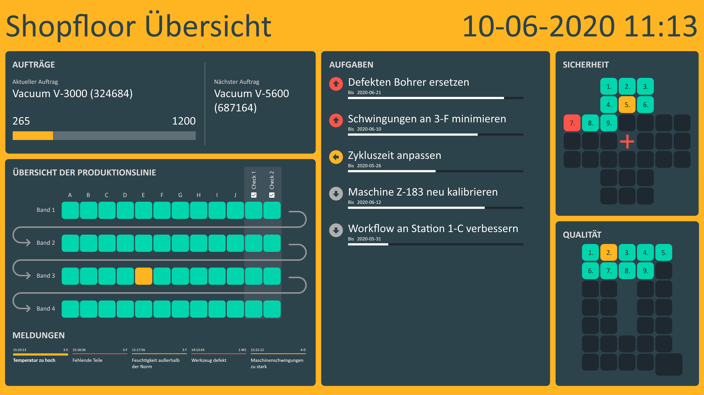
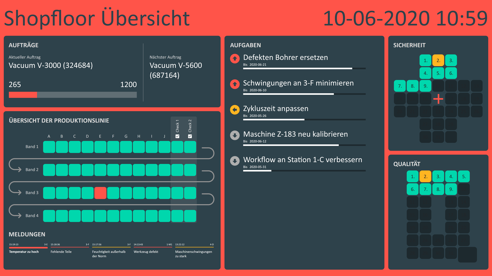

# Mögliche Datenquellen
Dieses Template verwendet Peakboard [Variablenlisten](https://help.peakboard.com/scripting/de-variables.html) als fiktive Datenquellen. In einem echten Szenario könntest du stattdessen deine System anbinden. Daten für die verschiedenen Bereiche dieses Boards könnten aus ganz unterschiedlichen Systemen kommen. ERP Systeme wie: abas ERP, proALPHA ERP, Epicor ERP, Comarch ERP, QAD Adaptive ERP, SAP oder viele mehr. Es könnten auch MES Systeme wie z.B.: AIS Automation FabEagle MES, camLine InFrame Synapse MES, DELMIA Apriso MES, DE DESC, FASTEC 4 PRO, Felten PILOT:MES oder Forcam Force angebunden werden. Oder auch Maschinennahe Kommunikationsmethoden wie: MQTT, OPC UA, Siemens S7, Azure Event & IoT Hub, Werma, Mitsubishi Electric, Beckhoff Automation, Bosch IoT Gateway, Rockwell Automation oder MT Connect. Es gibt viele Datenquellen die du für dieses Board verwenden könntest, eine Übersicht findest du [hier](https://peakboard.com/schnittstellen/).

# Weitere Zustände

Ein Problem ist aufgetreten, es wird eine Warnung angezeigt:

Ein Fehler ist aufgetreten:

