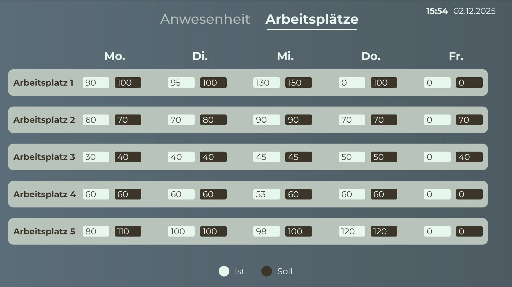

# Mögliche Datenquellen
Dieses Template verwendet eine Peakboard Hub Liste als zentrale Datenquelle. Die Namen der Mitarbeitenden, Namen der Maschinen, sowie die Soll/Ist-Werte der Maschinen werden in Peakboard Hub Listen gespeichert. Um dieses Template mit deinem eigenen Peakboard Hub zu nutzen, kannst du hier die Tabellenstrukturen herunterladen.
# Weitere Anzeigen

Ansicht Produktionsmenge der Maschinen : 

