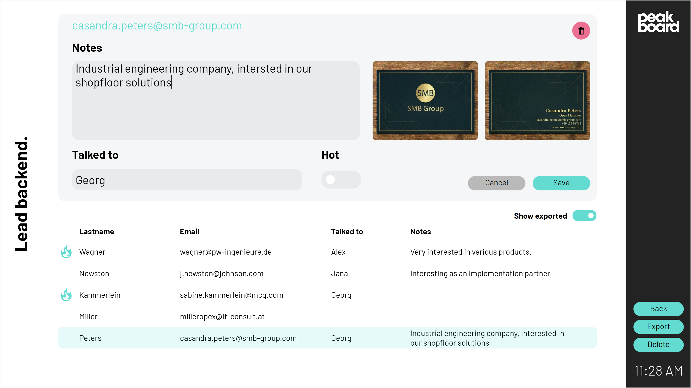

# Possible data sources
This template uses a <a href="https://www.peakboard.com/en/product/peakboard-hub" class="inline">Peakboard Hub List</a> as the data source for captured leads, as well as Peakboard Hub Files to store images of business cards. To use this template with your own Peakboard Hub, you can download the table structure of this list <a href="Leads.csv" class="inline" download>here</a>. Import them into your Peakboard Hub and then adjust the data source in the template accordingly.

# Lead backend
By clicking on the Peakboard logo in the upper right corner, the lead backend can be opened. Here, captured leads can be viewed, edited, exported, or deleted.

