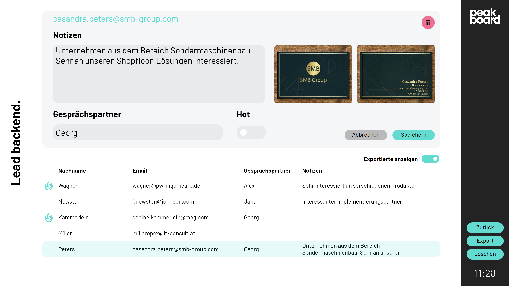

# Mögliche Datenquellen
Dieses Template verwendet eine <a href="https://peakboard.com/produkt/peakboard-hub/<" class="inline">Peakboard Hub Liste</a> als Datenquelle für die erfassten Leads sowie die Peakboard Hub Files um die Bilder der Visitenkarten zu speichern. Um dieses Template mit deinem eigenen Peakboard Hub zu nutzen, kannst du <a href="Leads.csv" class="inline" download>hier</a> die Tabellenstruktur dieser Listen herunterladen. Importiere diese in deinen Peakboard Hub und passe anschließend die Datenquelle im Template entsprechend an. 

# Lead Backend
Mit einem Klick auf das Peakboard Logo im oberen rechten Bereich, lässt sich das Lead Backend öffnen. Hier können die erfassten Leads eingesehen, bearbeitet, exportiert oder gelöscht werden.
