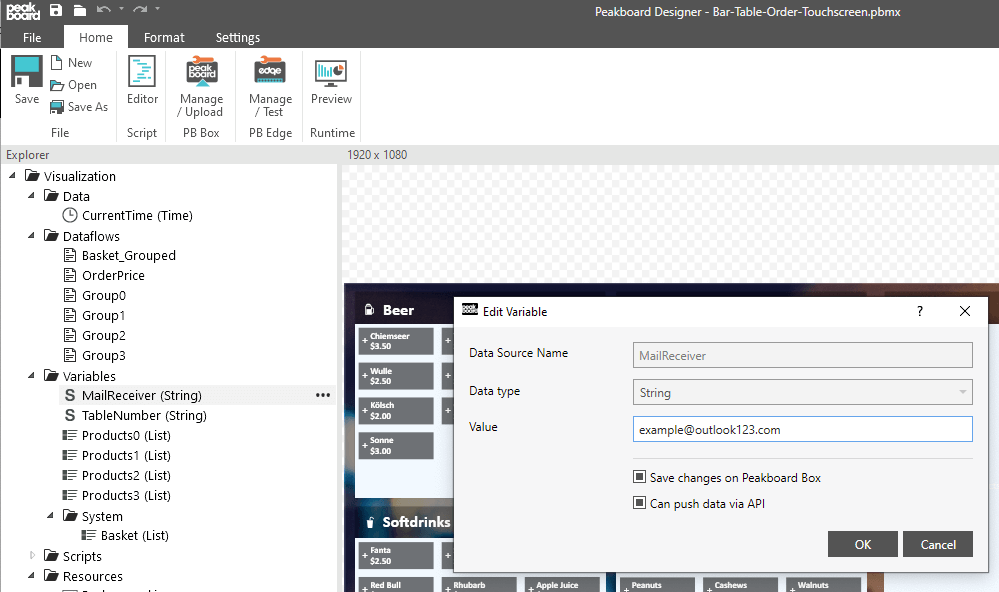

# 可使用的数据源

看板采用简单的变量列表作为数据源，能让您直接在Peakboard Box上保存参数。您可自由选择可视化以及数据集成的方式。其他可使用的数据源举例：JSON，XML，CSV，ODBC，Microsoft SQL Server，MS Access，MySQL，微软Excel，谷歌文档/工作簿，微软SharePoint列表以及[其他](https://peakboard.com/en/data-connections/)。

# 如何使用

"在‘变量’中调整‘MailReceiver’值，并输入您的邮箱地址。当顾客点击“下单”时，订单就会直接发送至该邮箱。您可以使用变量列表‘Products0’，‘Products1’，‘Products2’和‘Products3’，输入商品名称以及价格。调整‘TableNumber’变量值，为每个屏幕设定一个桌号。“

如有多个屏幕，您可以使用一种中心数据源，例如Excel工作簿，将饮品和餐食保存在云服务中，并对其进行管理。

背景图片[designed by Mrsiraphol / Freepik](http://www.freepik.com)
